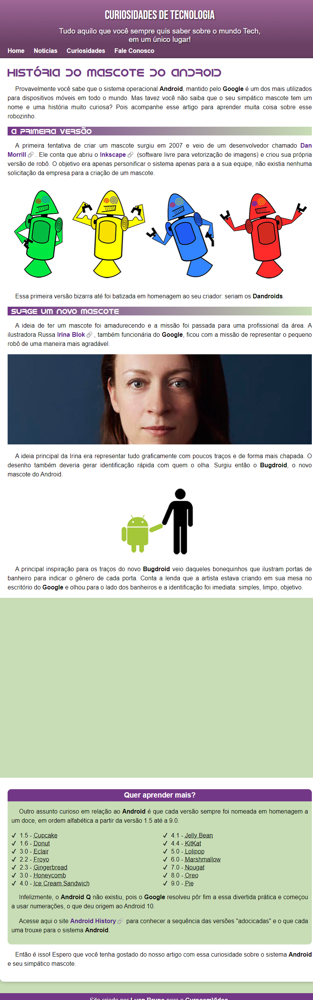

## Projeto Android

## 💻 Projeto

Projeto desenvolvido no Curso em Vídeo, sobre HTML5 e CSS3

> **link do projeto:** [🔗clique aqui para acessar](https://luanfreiitas.github.io/projeto-android)

###

**✏️Linguagens:**

- [HTML5](https://developer.mozilla.org/pt-BR/docs/Web/HTML)
- [CSS3](https://developer.mozilla.org/pt-BR/docs/Web/CSS)

**🚀Tecnologias:**

- [Visual Studio Code](https://code.visualstudio.com)
- [Git](https://git-scm.com) | [GitHub](https://github.com)
